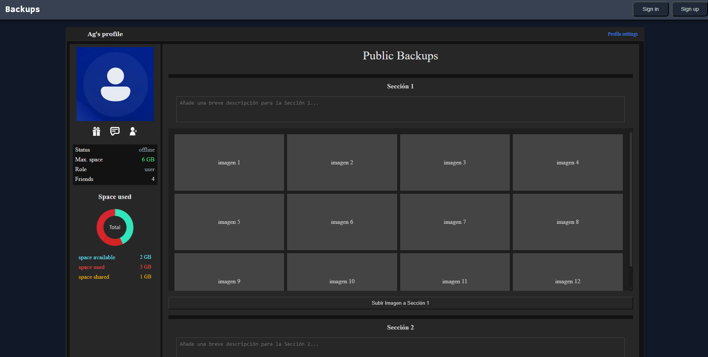

# Backups
App with the objetive of letting you storage all type of data and files. You'll need to be authenticated first

## some of the features that this app will have:

* Storage for authenticated user (with mb/gb limit)
* Configs to make your uploads public/private, so other users are able to see them
* Level system that will grant benefits such like more space to store
* Some social media interactions between users
* User profiles

many features aren't avialable yet since i'm working on them

## this is how profile section looks like for now when you're correctly authenticated

## main tools used:

* js/ts
* node/express
* react
* redux-toolkit
* mysql
* tailwind

## how to run locally

in case you want to see it on your local (idk why you would, since it's far from being finished) you have to install the dependencies first.

* once you have the repo on your local, use npm install in the backend and frontend folder to install all dependencies
* create .env with all the variables needed (PORT_BACKEND=AnyPortYouWant, JWT_SECRET=YourSecretHere, JWT_REFRESH_SECRET=YourRefreshSecretHere, NODE_ENV=dev)
* you have to use a server for the backend and its database (i use xampp for now)
* use npm start to run the backend (node) and npm run dev to run the frontend (vite)
* in case that the database is not configurated you can create your database locally with xampp and apply its configuration in the database.js file

note: tailwind may break in development sometimes, if that happen and the styles break just rerun the frontend again