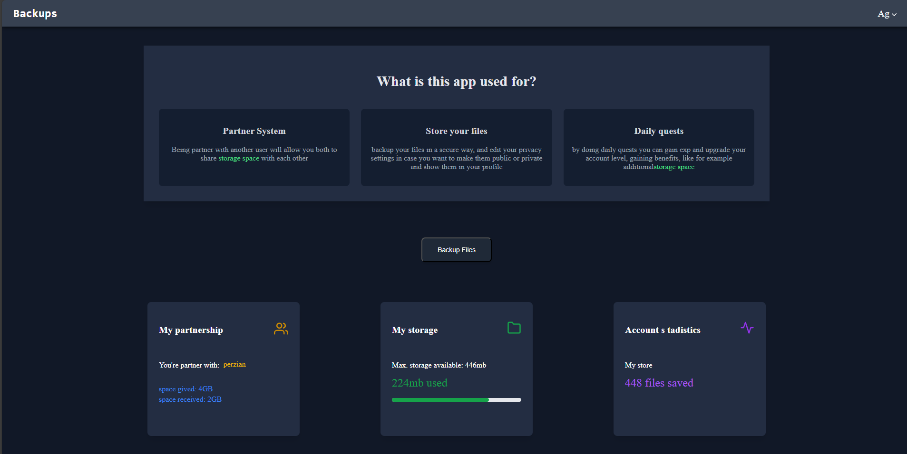
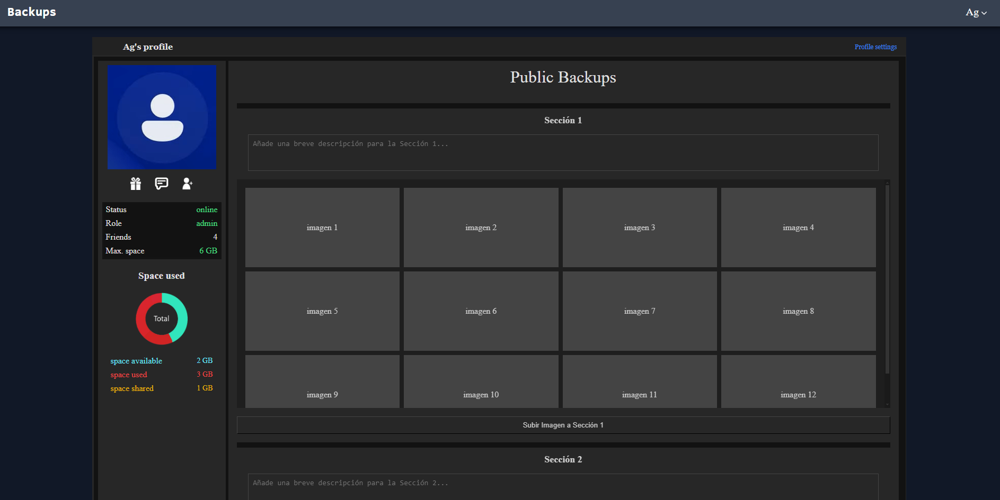

# Backups
This app will let you store files, getting level for more space and organizing your profile to make them
private or public. You'll need to be validated as a user to access.

## some of the features that this app will have:

* Strong securiy flow for accounts, using OAuth with token rotation and encrypting. More info in AuthFlow-info.md
* Storage for authenticated user (with mb/gb limit)
* Configs to make your uploads public/private, so other users are able to see them
* Level system that will grant benefits such like more space to store
* Minimum social media interactions between users
* User profiles

many features aren't avialable yet since i'm working on them

### some previews of sections (changes on the frontend will be made)

Dashboard section

Profile section

## main tools used:

* typescript
* node/express
* react
* redux-toolkit
* mysql
* tailwind

### First setup
* once you have the repo on your local, use npm install in the backend and frontend folder to install all dependencies
* create .env for /backend and /frontend and modify it with your own configs (see .env.examples to see what you need)

### Database setup
- you must have installed mysql on your computer and run its service so the database and backend can work(W+R -> services.msc -> run/stop mysql service), you can also use MySQLWorkbrench for a better view of the database (you'll need to connect the schema to the db with the 
credentials)
- in case you want to create your own database, you can read the "backend/db/db_code_info.txt" file, there you have the code to create the tables

### how to run the project locally
Open visual studio terminal, step on frontend and backend folder and run:
* for dev: __npm run dev__ (if there are typescript errors, this run will fail and ask you to fix them)
* for build dist: __npm run build__
* for production: __npm start__

Notes:
. Vite changes its port when it's running on production or development, make sure to change the frontend port in the .env files
and in the package.json of the frontend since it's using wait-on http://localhost:Your-port
. Tailwind may break in development sometimes, if that happen and the styles break just rerun the frontend again
