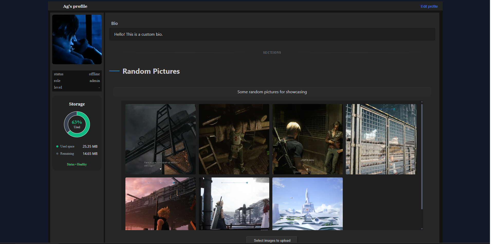
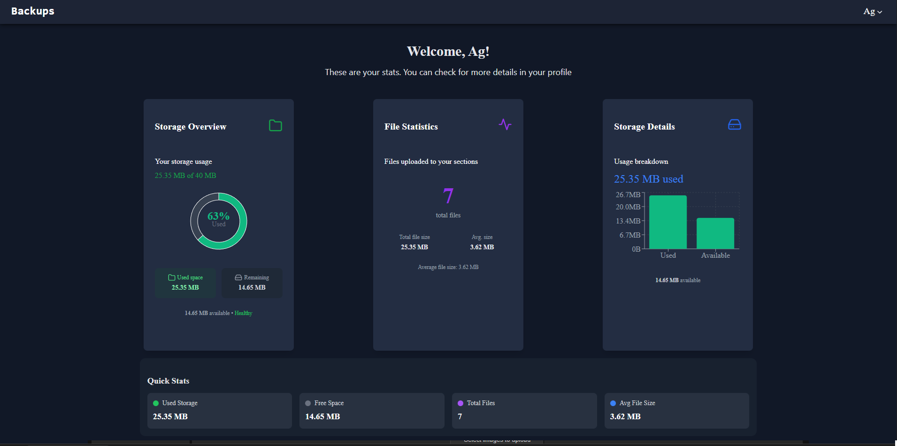
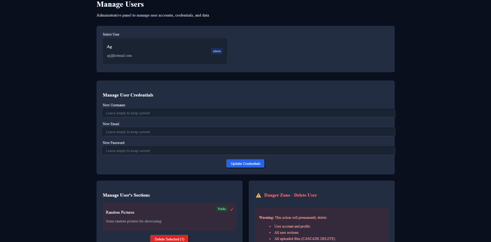

# Backups (in progress)
This app will let you store images and leveling up your account to gain benefits.

### Features that are already implemented:

* Securiy flow for accounts using token rotation
* Profiles where users can upload images to their sections
* Optimized images with Cloudinary SDK
* Make your sections public/private
* Admin Dashboard to manage users and their profile

### Features in progress:
* Level system that will grant benefits
* Daily quests to gain more exp and level up

### Previews (not final design)

Profile

Dashboard

Admin Pannel

## Stack used

* Typescript
* React
* Redux-toolkit
* Tailwind
* Axios
* Tanstack router / Tanstack Query
* Zod
* Node/Express
* Mysql
* BetterAuth
* Cloudinary
* Prisma
* Vitest

### Architecture
* Backend: Clean Architecture with SOLID principles
* Frontend: Feature-based Architecture

### How to setup repository locally
* Use **npm install** to install all dependencies in the backend and frontend folder
* Configure .env file for backend and frontend

### Database setup
- You must have installed mysql on your computer and run its service (W+R -> services.msc -> run/stop mysql service), you can also use MySQLWorkbrench for a better view (you'll need to connect the schema to the db with the credentials)
- All the DDL's for tables are in `backend\src\db\db_DLL.md`

### Cloudinary Storage setup
- Create account in https://cloudinary.com, then "View API keys" to see your credentials and put them in /backend/.env

### Run scripts
* dev: __npm run dev__ <- if there are typescript errors, this run will fail and ask you to fix them
* build dist: __npm run build__ <- create dist folder ready for production
* vite preview: __npm run preview__ <- run the production dist files in a local server
* lint: __npm run lint__ <- run linter
* tests: __npm run test__ <- run tests
* coverage: __npx vitest run --coverage__ <- create coverage